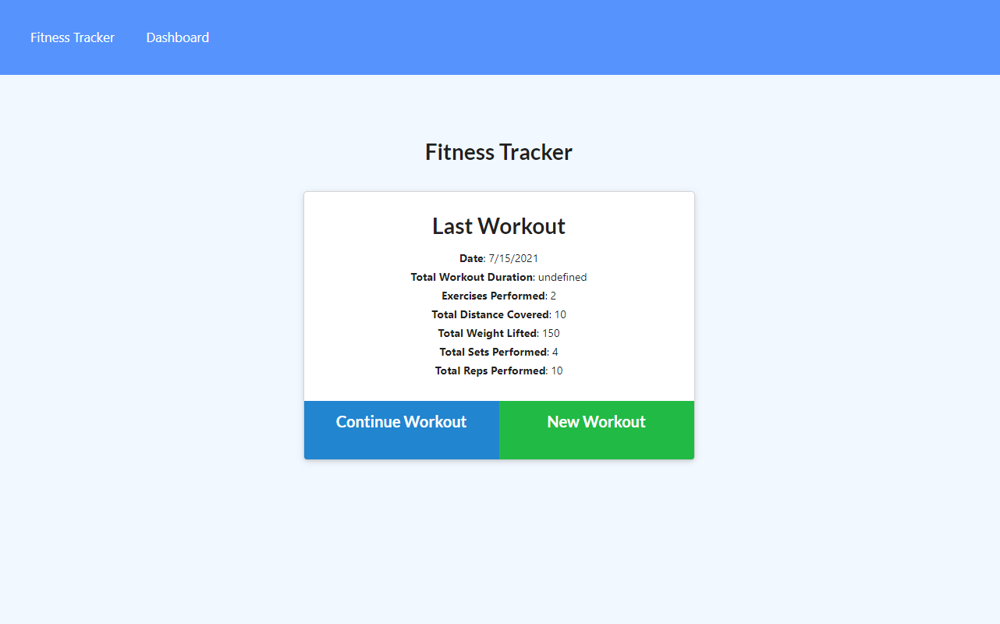

# Workout-Tracker
## About Workout-Tracker

The purpose of this educational assignment was to practice developing with NoSQL databases using mongoose and MongoDB, creating and deploying a workout/fitness tracker.

1. Present user with homepage to create or continue workouts.
2. User can add exercises to the most recent workout plan.
3. Users are also able to add new exercises to a new plan.
4. Users are able to enter titles, repetitions, and durations of each workout etc.
5. After submitting, users are able to see a total aggregate of their routines on the 'homepage'.
6. On the dashboard, they can view charts listing timed durations in 'mins' and weight lifted in 'pounds'.
7. Additionally, users can see on the 'homepage' the date and number of excercises performed.

## Use:

User can create/continue a workout routine and track the progress.

Install:

If running on local machine to test run:
* npm i
* npm install mongodb
* npm install mongoose
* npm run seed
* npm start

*Used to learn, practice, test, understand, and implement various fullstack dev and database deployment (mongoose/mongodb/Heroku/mongoAtlas) tools: 

* NoSQL databases
* mongoose
* Heroku deployment
* Creating a MongoDB Atlas cloud db
* Create and display routes 
* Create and use mongoose schema

## Contacts/Deployed links:

* https://github.com/kitclong/Workout-Tracker
* https://stark-eyrie-26335.herokuapp.com/

## Acknowledgments:

* mongoDB
* mongoose
* Heroku
* npm
* MDN Web Docs
* w3schools
* Stackoverflow
* Trilogy Education services
* Additional private tutoring
